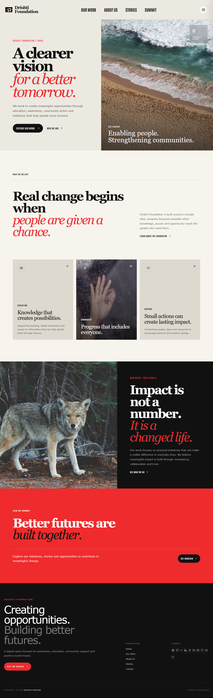

# Drishti Foundation

A responsive React foundation website for education, awareness, community participation, opportunities, events, publications, and social impact work.



## Features

- Responsive Vite and React website with fixed header and mobile drawer
- Lazy-loaded pages for work, stories, events, publications, opportunities, and legal content
- Nested route highlighting and route scroll reset
- Accessible go-to-top control, local brand assets, and icon-only external footer links
- Custom 404 page and GitHub Pages deployment support

## Tech stack

React, Vite, React Router, styled-components, Material UI, JavaScript, and React Icons.

## Run locally

```bash
npm install
npm run dev
```

Build and deploy:

```bash
npm run lint
npm run build
npm run deploy
```

## Links

- Portfolio: [https://www.ashishranjan.net/](https://www.ashishranjan.net/)
- GitHub: [https://github.com/a2rp](https://github.com/a2rp)
- CodePen: [https://codepen.io/ash1198](https://codepen.io/ash1198)
- LinkedIn: [https://www.linkedin.com/in/aashishranjan](https://www.linkedin.com/in/aashishranjan)
- Facebook: [https://www.facebook.com/theash.ashish/](https://www.facebook.com/theash.ashish/)
- YouTube: [https://www.youtube.com/@ashishranjan-ashz?sub_confirmation=1](https://www.youtube.com/@ashishranjan-ashz?sub_confirmation=1)
- Email: [mailto:ash.ranjan09@gmail.com](mailto:ash.ranjan09@gmail.com)

## Support

- Support: [https://a2rp-donation-page.netlify.app/](https://a2rp-donation-page.netlify.app/)
- Buy Me a Coffee: [https://buymeacoffee.com/a2rp](https://buymeacoffee.com/a2rp)
- Patreon: [https://www.patreon.com/a2rp](https://www.patreon.com/a2rp)
